# SmartPark AI Parking Chatbot (Version 4)

SmartPark AI Parking Chatbot is a **Retrieval-Augmented Generation (RAG)** project that answers questions about a parking service and manages parking reservations with human-in-the-loop admin review. The system combines vector search with a language model to provide context-aware answers, and uses a LangGraph state machine with SQLite checkpointing to persist reservation workflows across process restarts.

---

## Features

* RAG-based question answering using LangChain
* Vector search powered by Milvus
* Parking reservation storage using SQLite
* Guardrails to protect sensitive information
* Evaluation pipeline with retrieval and response metrics
* Human-in-the-loop (HITL) reservation workflow using LangGraph `interrupt_before` + SqliteSaver
* Reservation graph state persisted in SQLite (`data/checkpoints.db`) — survives process restarts
* Admin approval/rejection resumes the graph via `update_state` + `invoke`
* Email notification after admin review of the reservation request
* Automated test pipeline for the reservation graph (5 pytest tests)

---

## Reservation Graph

The reservation workflow is implemented as a LangGraph state machine with a human-in-the-loop interrupt. When a user submits a reservation, the graph runs up to the `admin_review` node and then pauses, persisting state in `data/checkpoints.db`. The admin API resumes execution by injecting the decision and re-invoking the graph.

```
create_proposal → (error?) → END
      ↓ (ok)
create_pending → notify_pending → [INTERRUPT: admin_review]
                                        ↓
                                  admin_review (conditional)
                                 ↙                ↘
                        notify_approved      notify_rejected
                              ↓                    ↓
                          mcp_log                 END
                              ↓
                             END
```

| Node | Description |
|------|-------------|
| `create_proposal` | Validates fields, finds an available parking spot (P1–P8) |
| `create_pending` | Inserts reservation into SQLite with `status=pending` and stores `thread_id` |
| `notify_pending` | Returns "awaiting approval" message to user |
| `admin_review` | **Interrupt point** — graph pauses here until admin decision |
| `notify_approved` | Sets `status=approved`, sends approval email |
| `notify_rejected` | Sets `status=rejected`, sends rejection email |
| `mcp_log` | POSTs approved reservation to the MCP audit server (port 9000) |

The graph instance (with SqliteSaver checkpointer) is a singleton defined in `graph_instance.py` and shared by both `app.py` and `admin_api.py`.

---

## Project Structure

```
app.py                 # Main chatbot entry point (CLI state machine)
config.py              # Configuration (API keys, chunking, Milvus settings)
rag.py                 # RAG chain creation
milvus_store.py        # Vector store creation and loading
reservation.py         # Reservation database logic (SQLite)
reservation_graph.py   # LangGraph HITL workflow definition
graph_instance.py      # Singleton graph + SqliteSaver checkpointer
admin_api.py           # Admin REST API (approve/reject via graph resume)
mcp_server.py          # Audit log microservice (port 9000)
email_service.py       # Email notification via Gmail SMTP
guardrails.py          # Input/output security and safety rules

evaluation.py          # RAG system evaluation pipeline
evaluation_dataset.json
test_pipeline.py       # Automated tests for the reservation graph

data/
 ├─ parking_info.txt      # Knowledge base
 ├─ parking_chatbot.db    # SQLite reservation database
 └─ checkpoints.db        # LangGraph state checkpoints (runtime)
```

---

## Technologies

* Python
* LangChain
* LangGraph
* OpenAI API
* Milvus Vector Database
* SQLite (reservations + LangGraph checkpoints)
* `langgraph-checkpoint-sqlite` (graph state persistence)

---

## Knowledge Base

The chatbot retrieves information from `parking_info.txt`, which contains details about:

* parking prices
* working hours
* reservation policies
* EV charging
* safety rules
* additional services
* contact information

The document is split into chunks and embedded into a vector database for semantic search.

---

## Evaluation

The project includes an evaluation pipeline to measure RAG performance.

Metrics used:

* **Recall@K** – fraction of relevant information retrieved
* **Precision@K** – relevance of retrieved chunks
* **Semantic Similarity** – similarity between generated answer and reference answer
* **Accuracy** – percentage of answers above similarity threshold
* **Latency** – response time

Example results:

```
Average Recall@3: 0.769
Average Precision@3: 0.500
Average Semantic Similarity: 0.863
Accuracy: 0.692
Average Latency: 1.138 sec
```

---

## Setup

Install dependencies:

```
pip install -r requirements.txt
```

Set your OPENAI_API_KEY, EMAIL_USER, EMAIL_PASSWORD, MCP_API_KEY in .env file.
Set up Milvus Standalone (https://milvus.io/docs/install_standalone-docker.md)

Run MCP server command in separate terminal:

```
uvicorn mcp_server:app --port 9000
```

Run API command in separate terminal:

```
uvicorn admin_api:app --port 8000
```

Run the chatbot:

```
python app.py
```

Run evaluation:

```
python evaluation.py
```

Run tests:

```
python -m pytest test_pipeline.py -v
```

---

## Example Questions

* What are the parking prices?
* Is the parking open 24/7?
* Can electric vehicles charge here?
* How can I reserve a parking space?
* How do I cancel a reservation?

---

## Milvus details

* Milvus engine is running in docker
* Here is the instruction how to set up Milvus Standalone in docker: https://milvus.io/docs/install_standalone-docker.md


## Example of usage

Run docker container with Milvus Standalone:
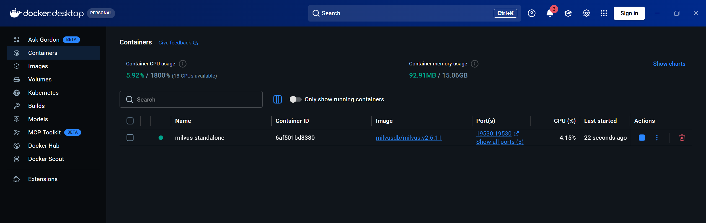

Run MCP server:
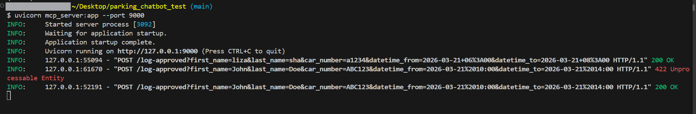
Also check if MCP service is secure. 
Try without API key or with wrong API key
```
curl -X POST "http://localhost:9000/log-approved?first_name=John&last_name=Doe&car_number=ABC123&datetime_from=2026-03-21%2010:00&datetime_to=2026-03-21%2014:00" / -H "X-API-KEY: wrong_api_key"
```
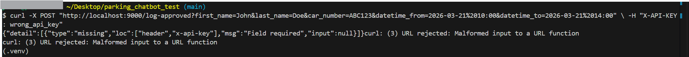

Try with correct API key
```
curl -X POST "http://localhost:9000/log-approved?first_name=John&last_name=Doe&car_number=ABC123&datetime_from=2026-03-21%2010:00&datetime_to=2026-03-21%2014:00" / -H "X-API-KEY: correct_api_key"
```
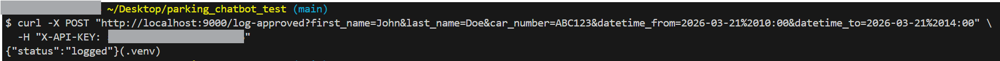

Run API service:
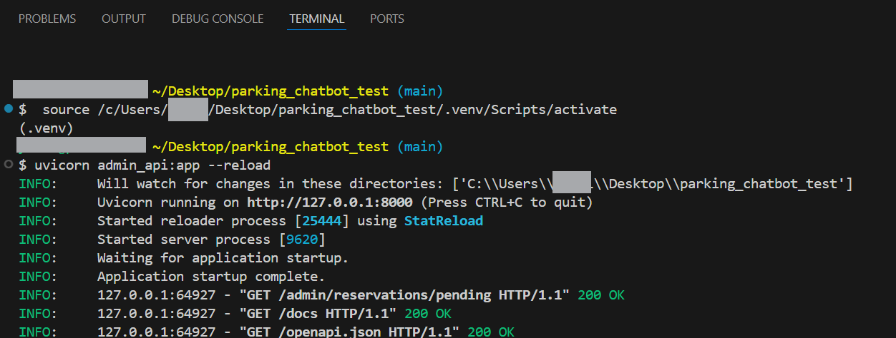

API admin service is running:

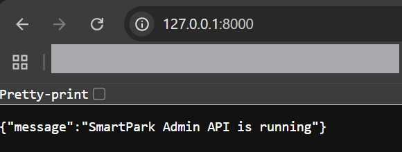
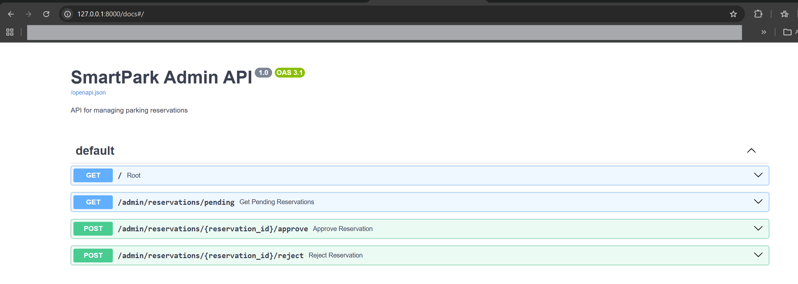

Run app.py in separated terminal and start use chatbot:
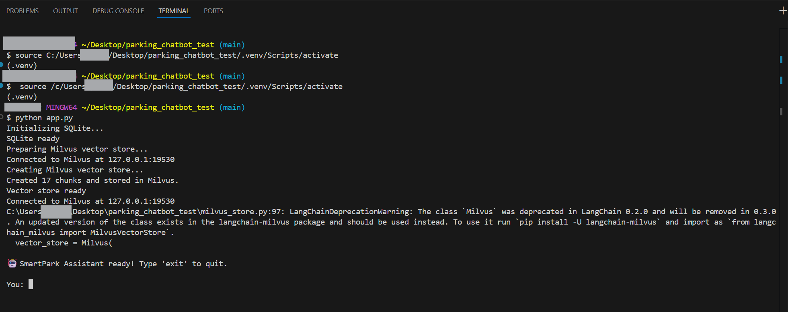

Questions answers:

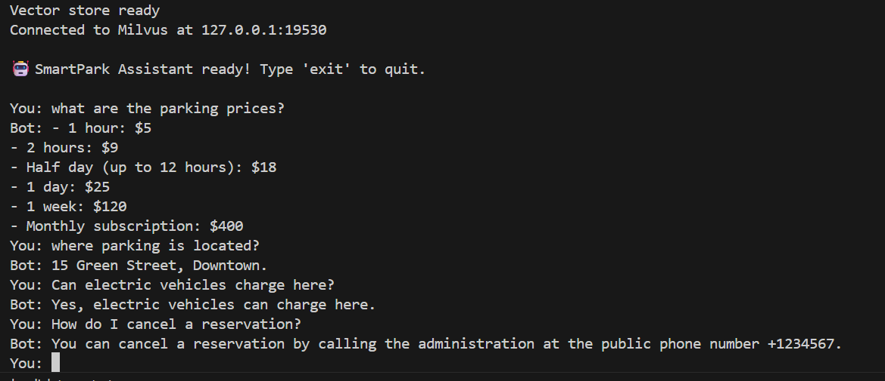

Reservation flow:

1) collect user's data → LangGraph runs `create_proposal` → `create_pending` → `notify_pending`, then pauses at `admin_review` interrupt; graph state saved to `data/checkpoints.db`

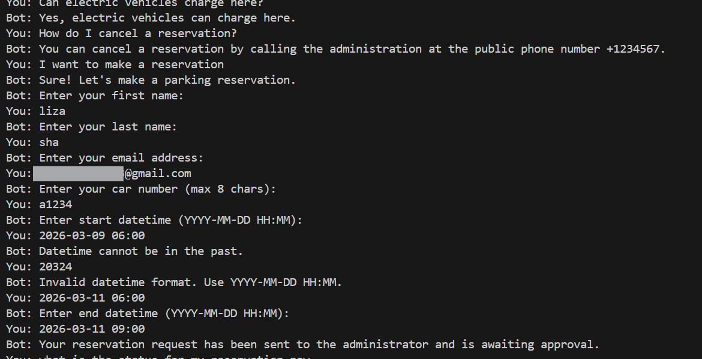

2) ask bot about reservation status before admin approves

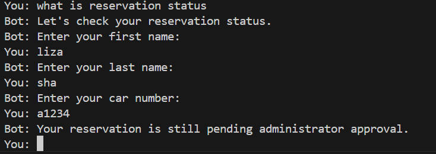

3) admin calls `POST /admin/reservations/{id}/approve` → API retrieves `thread_id` from DB, calls `graph.update_state({"admin_decision": "approve"})` and `graph.invoke(None, config)` to resume; graph runs `notify_approved` → `mcp_log`; approval email is sent

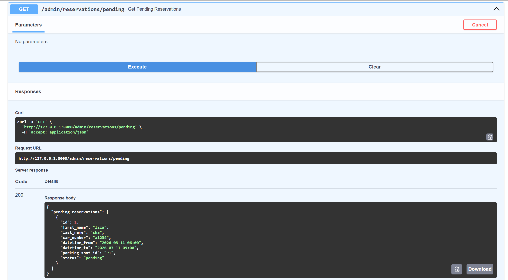
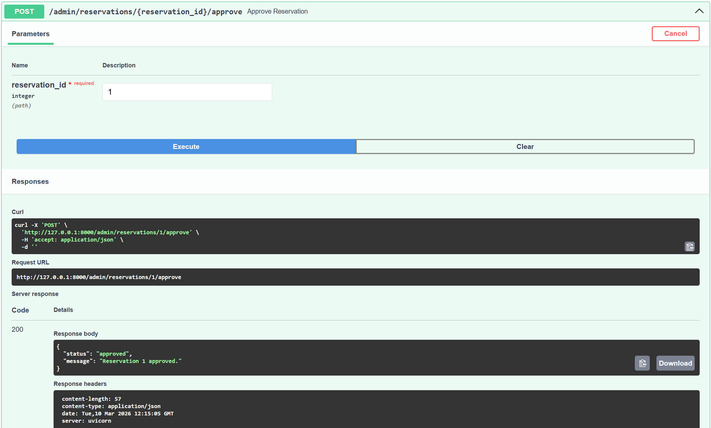
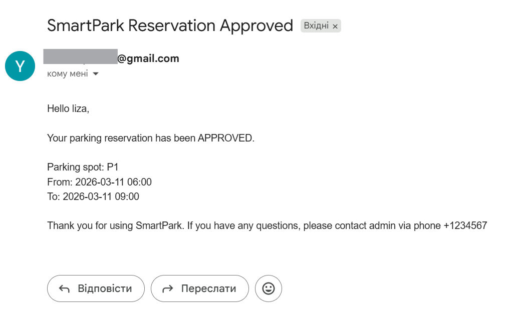
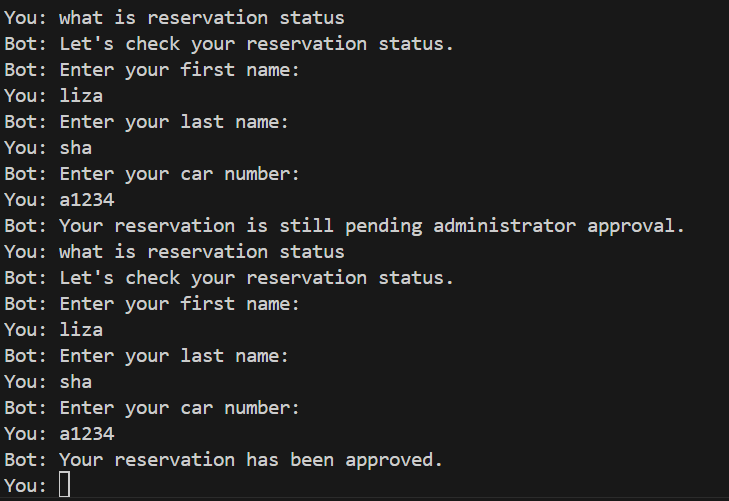

4) check if output file is created (`data/approved_reservations.txt` written by MCP server):
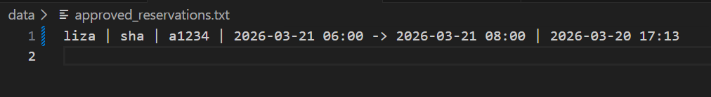

5) type 'exit' to finish chat

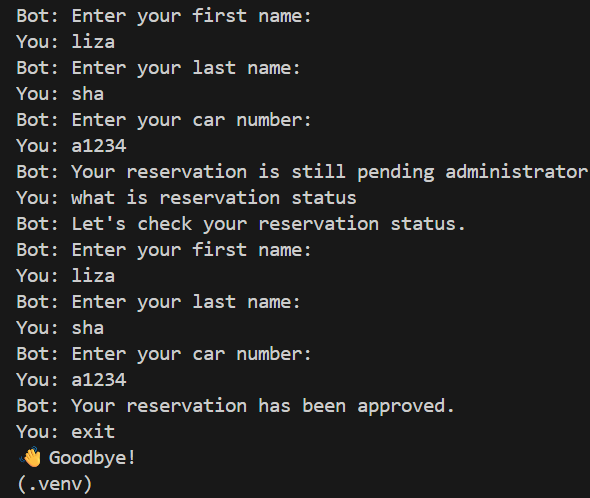
